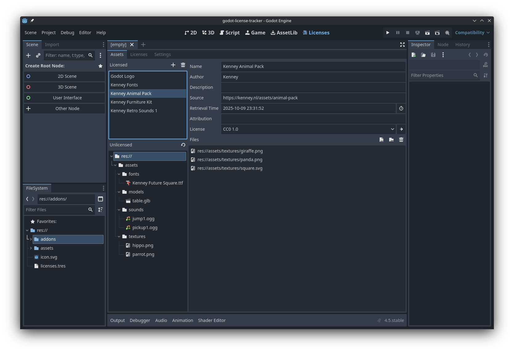
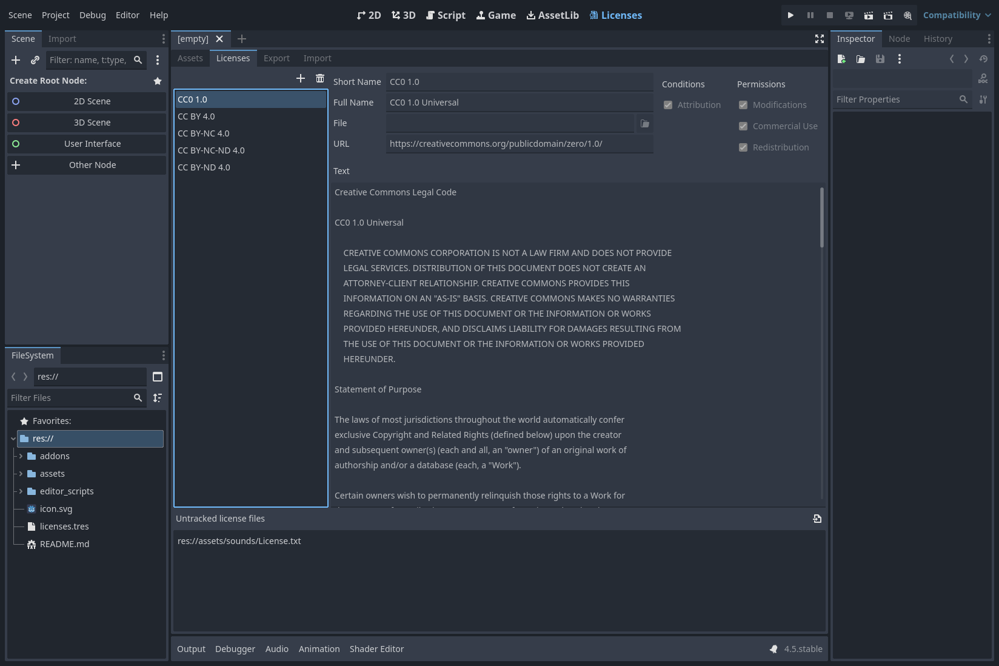

# License Tracker Plugin for the Godot Editor

A Godot Editor plugin for keeping track of licenses of third-party assets in your Godot project.

## Screenshots

More screenshots are available in the [screenshots](/screenshots) directory.

## Install

At this point, the only available installation method is to grab the source code, by downloading it as a zip file or cloning the repository, and then copying the `addons/` directory into your project.

If there is any interest in the plugin, I will create proper releases and submit it to the Godot Asset Library.

> [!NOTE]
> If you just want to test the plugin, you can just load a copy of the repository in Godot.
> It contains a project file as well as a few example asset files.

## Usage

After installing the plugin, make sure to enable it in the project settings (**Project** -> **Project Settings...** -> **Plugins**).
As soon as it is enabled, a new **Licenses** tab appears in the main screen.
Selecting it reveals the main interface of the plugin which also has multiple tabs.

### Assets

The **Assets** tab gives you an overview of the third-party assets in your projects.
Initially, all imported resources will be listed in the *Unlicensed* panel since they do not have any licensing information associated with them.

After creating a new licensed asset collection, you should fill out some additional information about it:

- **Name:** Name of the licensed asset or asset pack
- **Author:** Name of the author
- **Description:** Optional description, intended mainly for identifying which assets are contained in the collection
- **Source:** URL or alternative description of where the assets were obtained
- **Retrieval Time:** Optional date and time of when the assets were retrieved
- **Attribution:** Optional custom attribution string
- **License:** License associated with the assets (see [Licenses](#licenses))
- **Files:** List of files and folders making up the collection

Files and folders can be added to collections using the dedicated buttons or by dragging and dropping them from the file system dock or the unlicensed resources list.

> [!WARNING]
> At this point, there is no validation of the data you enter.
> As such, you can have duplicate collection names, multiple collections containing the same files and probably other unexpected states.

### Licenses

The **Licenses** tab lists all licenses that you can choose from.
These include a set of built-in definitions of common licenses, like different variants of Creative Commons.
Additionally, you can define additional licenses used in your project.
This is necessary if you rely on third-party assets that use custom licenses.

Creating a license entry should be self-explanatory.
You should provide either a short or full name for the license to be displayed properly in the list as well as the license selection in the [Assets](#assets) tab.
The remaining data is technically optional at this point, although it is intended to be used for additional features in the future.

## Planned Features

Below are some features that may come in the future.

- Automatic generation of a textual summary of all licensed assets suitable for the "Credits" section of a game
- Control over which files are tracked using inclusion and exclusion lists of patterns or similar approaches
- Filtering assets by permissions and/or restrictions imposed by licenses, e.g., listing all assets that do not allow commercial use
- Improved UX: resource previews, alternative interface locations (main screen, bottom panel)
- Optional integration in game export, e.g. disallowing a release export if any asset licensing information is missing

## License

[MIT © stesim](LICENSE)
